# CornerPet

**一只住在桌角的小生命。**

捏一只软乎乎的小家伙，或把喜欢的照片变成桌角伙伴。给它起个名字，再把它从网页带到 Mac 桌面：你忙的时候它自己发呆，点一点，它就回应你。

**[在线领养一只](https://cornerpet-companion.netlify.app/) · [下载 macOS 桌面版](https://github.com/ask6688/cornerpet/releases/download/v0.1.0/CornerPet-0.1.0-arm64.dmg)**

## Preview

### 故事从一个空桌角开始

每天打开电脑，桌角总是空着。如果那里住着一只小生命呢？它探头看看你，打个盹，然后安静地留下来。CornerPet 的开场小故事，把这个念头变成了 21 秒的相遇。

[](docs/assets/story-opening.mp4)

[播放完整开场短片](docs/assets/story-opening.mp4)

### 先捏出它的样子

从六种基础造型里挑一个，换颜色、试材质、选表情。每一次调整都会直接出现在眼前，直到你觉得：“嗯，就是它了。”

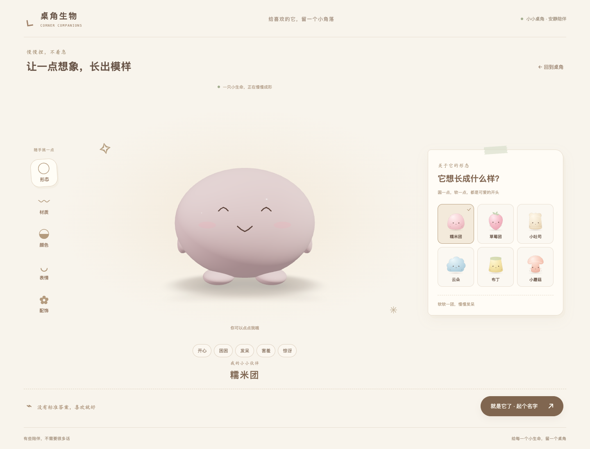

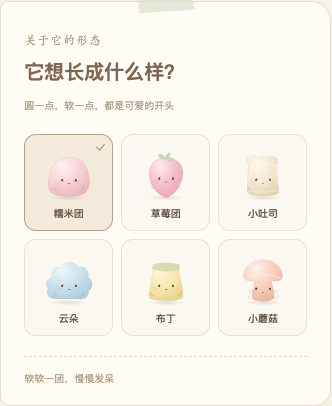

六位小伙伴，先用没有配饰的本来面目打个招呼：

<table>
  <tr>
    <th>糯米团</th><th>草莓团</th><th>小吐司</th><th>云朵</th><th>布丁</th><th>小蘑菇</th>
  </tr>
  <tr>
    <td>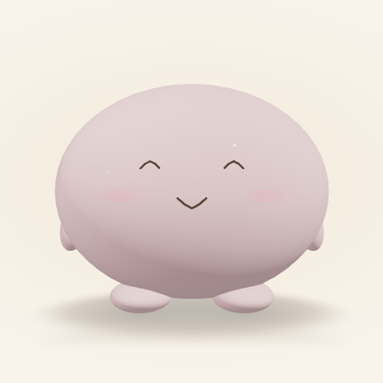</td>
    <td>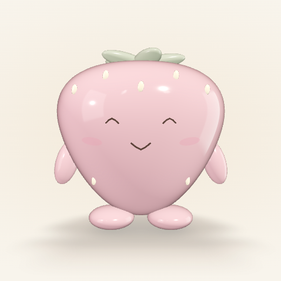</td>
    <td>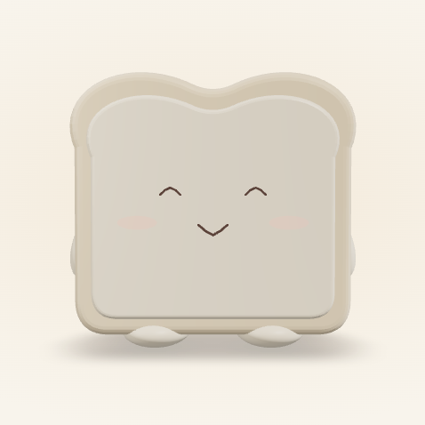</td>
    <td>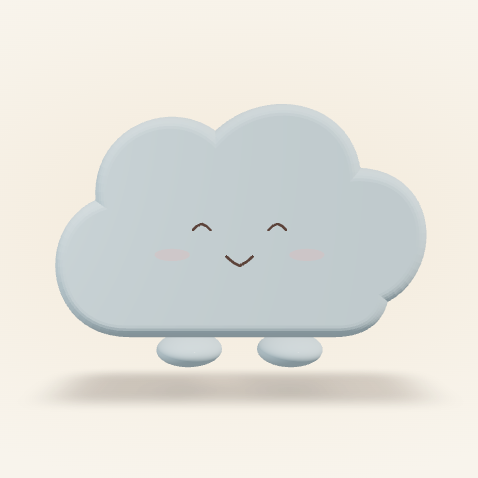</td>
    <td>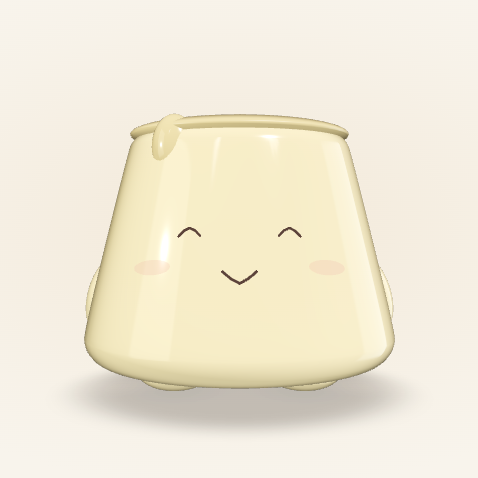</td>
    <td>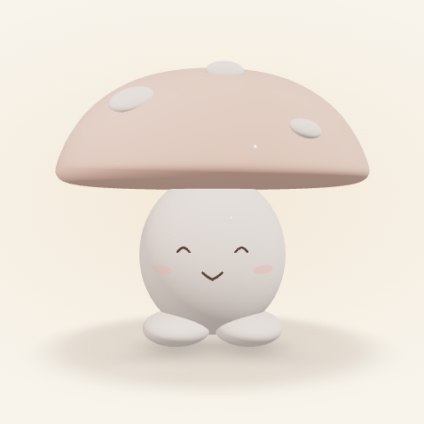</td>
  </tr>
</table>

### 也可以，把熟悉的它带来

宠物、玩偶，或一件舍不得收起来的小物件。上传照片，选择「保留它」，浏览器会去掉背景；再用橡皮修一修边缘，照片里的它就能以原来的模样陪在桌角。

<table>
  <tr><th>原始照片</th><th>本地抠图 · 产品实测</th><th>风格化方向 · 独立视觉示意</th></tr>
  <tr>
    <td>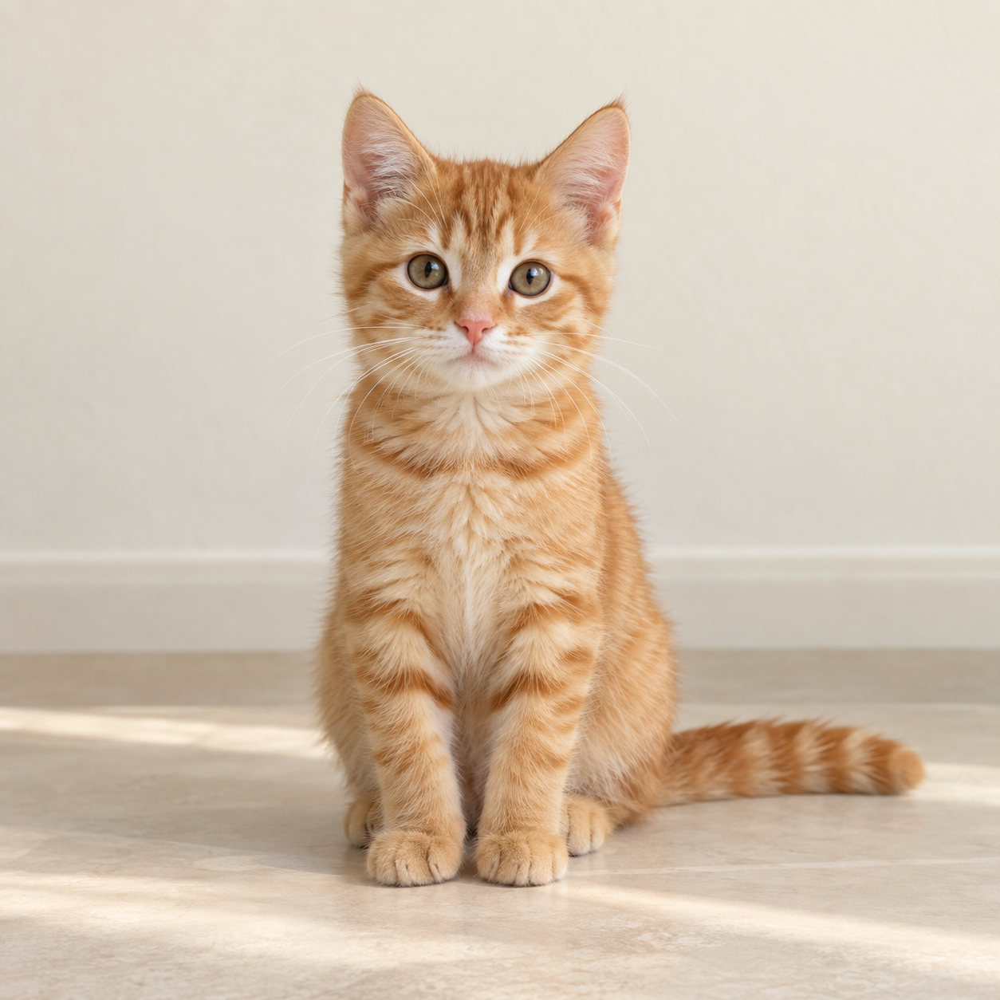</td>
    <td>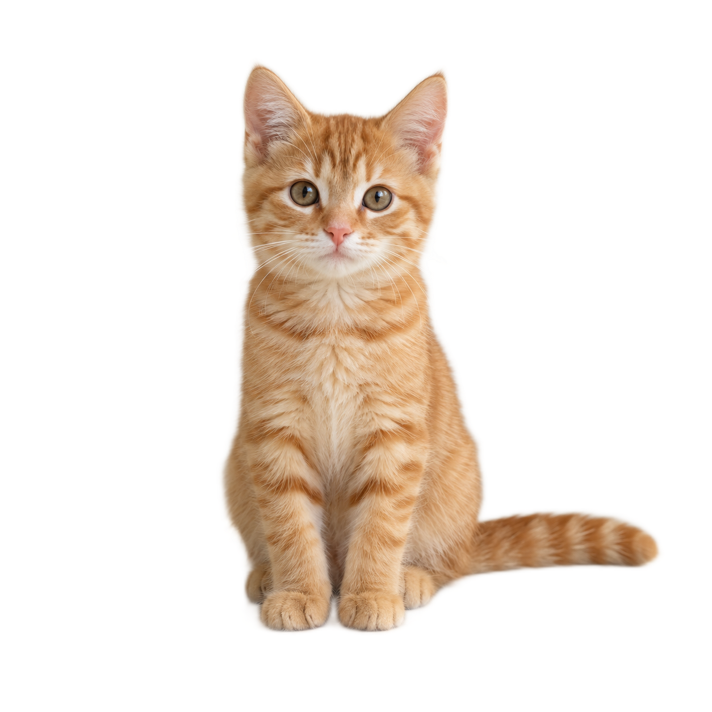</td>
    <td></td>
  </tr>
</table>

这组使用合成测试猫素材；右图是单独制作的风格参考。

想看看软乎乎的另一种模样，可以试试照片路径里的两种风格：

<table>
  <tr><th>糯米小团 · 预置 Demo</th><th>口袋毛绒 · 预置 Demo</th></tr>
  <tr>
    <td></td>
    <td>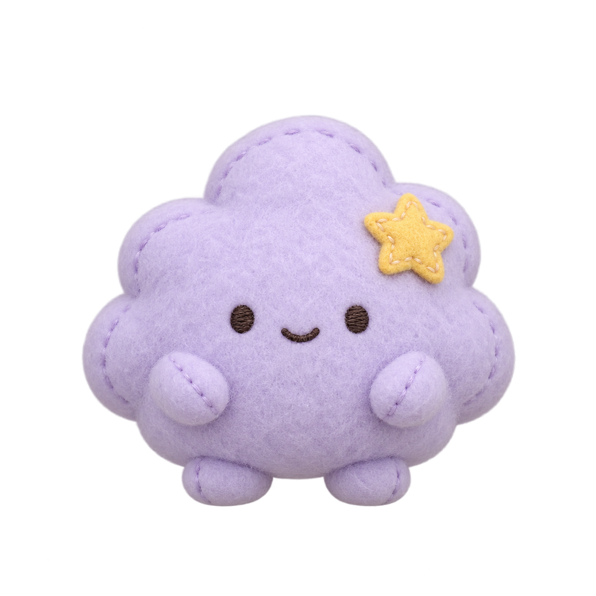</td>
  </tr>
</table>

同一只 Demo 小伙伴，也有自己的小情绪。下面是产品里的表情预览截图：

<table>
  <tr><th>开心</th><th>困困</th><th>发呆</th><th>害羞</th><th>惊讶</th></tr>
  <tr>
    <td>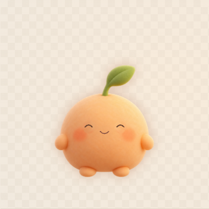</td>
    <td>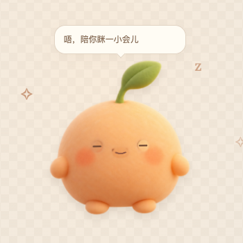</td>
    <td>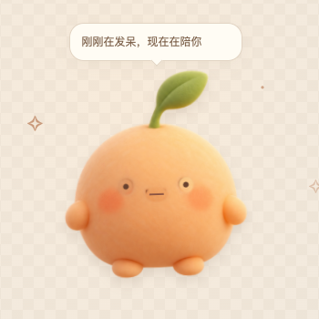</td>
    <td>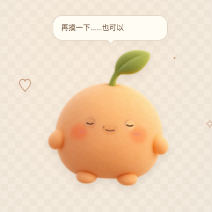</td>
    <td>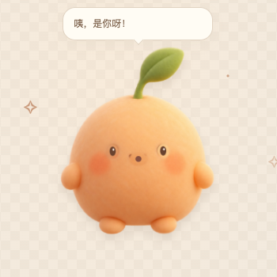</td>
  </tr>
</table>

### 起好名字，就带它回家

<table>
  <tr><th>从照片开始</th><th>它诞生啦</th></tr>
  <tr>
    <td>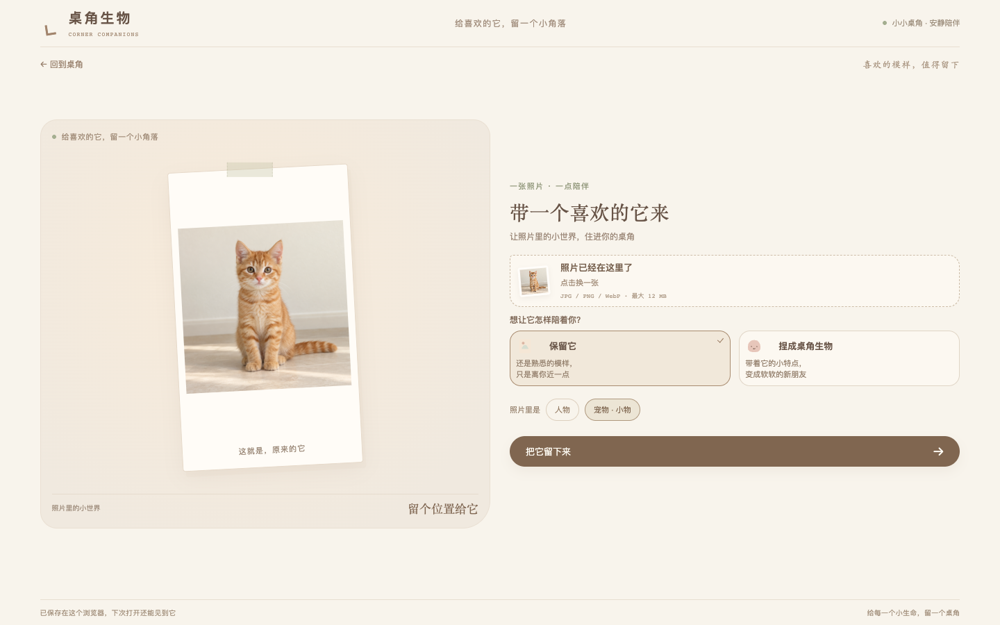</td>
    <td>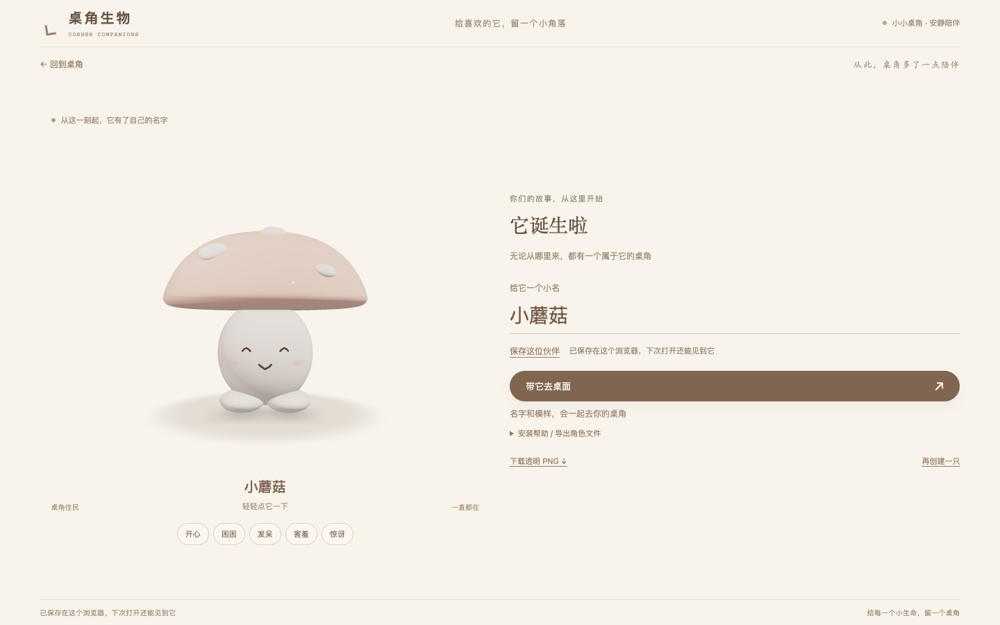</td>
  </tr>
</table>

点「带它去桌面」，角色就会交给这台 Mac 上的 CornerPet。连接成功，直接送达；没连上，页面会说明原因，并提供安装包入口和重试指引。装好后回到原页面，继续把刚刚创造的小伙伴接回家。

## Why I built it

工作时，我们已经有足够多会弹窗、会催促、会要求注意力的产品。我想试着做一只可以安静待在身边的小东西：不用聊很久，不用完成任务，偶尔看一眼，就知道它还在。

亲手创造是这段关系的起点。选择它的样子、给它起名字，再亲眼看着它来到桌面，让一个屏幕里的模型慢慢变成“我的那只”。

## Core Experience

- **捏出喜欢的样子**：六种 3D 造型，搭配材质、颜色、表情和配饰，边选边看。
- **保留熟悉的模样**：照片本地去背景，支持手动修整，做成透明背景的 2D 伙伴。
- **真的住到桌角**：保存后直接交给 macOS App，也可以导出 `.cornerpet` 文件留存、导入。
- **有回应，也会自己待着**：可以点击、拖动、调大小；它会发呆、入睡、醒来打招呼，并在长时间使用时轻轻提醒。

## Product Flow

**选一个来处 → 做出它的样子 → 预览、起名、保存 → 带它去桌面 → 开始陪伴**

DIY 路径从基础造型开始；照片路径可以保留原貌，也可以尝试风格化。两条路径汇合到同一个完成页，使用相同的保存、导出与桌面交接流程。第一次使用时，安装引导会在连接失败后出现；已经连接成功的用户可以直接继续。

## Key Product Decisions

1. **陪伴的分寸，比动作的数量重要。** 默认用轻微呼吸和偶发回应表达存在感；提醒有频率限制，也可以隐藏或退出。
2. **让“我的角色”贯穿整个体验。** 创建、命名、保存、带去桌面用的是同一份角色数据，用户的选择不会在换一个页面后消失。
3. **把安装放在用户需要的时刻。** 先让人创造出喜欢的角色，想带走时再引导安装。交接失败时保留成果，并给出下一步。
4. **基础体验留在本地。** 不用注册账号；照片保留模式在浏览器里处理，角色保存在浏览器或自己的 Mac 上。

## What I built

我把“桌角陪伴”从一个想法做成了可以亲手体验的产品原型：定义两条创建路径，设计开场故事与创建流程，完成 Web 工作台、照片处理、角色保存与导出，再把角色接到 Electron 桌面端。

从造型调整到桌面互动，从第一次安装到再次打开，仓库里包含这条完整链路的实现与核心逻辑测试。后续迭代也围绕实际体验展开：表情是否自然、按钮是否被遮住、没有 API Key 时是否说得清楚、角色是否真的能到桌面。

## AI in CornerPet

AI 一方面参与开发过程，辅助代码实现、展示素材制作和多轮体验调整；另一方面用于产品里的图像处理。照片去背景由浏览器里的 MODNet / U²-NetP 模型完成，照片保留模式无需云端 Key。

风格化预留了 Seedream 服务端接口。部署者配置自己的 `ARK_API_KEY` 后，用户仍然只需点击「创建我的桌角生物」，无需选择“真实生成”模式；未配置时会在创建时说明当前使用预置示例。Key 留在服务端，真实生成会将处理后的图片主体发送给图片服务。

## Current Status

**现在可以完整体验：** DIY 3D、照片本地抠图与修整、命名保存、`.cornerpet` 导出、Web → macOS 交接，以及桌宠的基础互动、睡眠和提醒。桌面安装包已提供下载。

当前照片风格化的预置 Demo 与上传照片无关；Seedream 接口已接入，但真实照片的生成效果仍待验证，配置 Key 也不等于保证调用成功。任意照片转可旋转 3D 模型尚未实现。桌面版目前面向 Apple Silicon Mac，使用临时签名，未做 Developer ID 签名、公证或 Intel Mac 验收。

## Try it

**[打开在线体验](https://cornerpet-companion.netlify.app/)**，先捏一只角色，或上传照片选择「保留它」。基础体验不需要账号和 API Key。

创建完成后点 **「带它去桌面」**。连接成功，小伙伴会直接出现在桌角；没连上时，页面会说明原因并给出安装入口：

1. 下载 [macOS 安装包](https://github.com/ask6688/cornerpet/releases/download/v0.1.0/CornerPet-0.1.0-arm64.dmg)（Apple Silicon，约 128 MB）。
2. 打开 DMG，把 CornerPet 拖入「应用程序」，再打开 App 一次。
3. 回到原网页重试「带它去桌面」，按浏览器提示允许打开 App 和连接本机。
4. 看着同名、同造型的小伙伴来到桌角，点一点，和它打个招呼。

页面里的「导出角色文件（.cornerpet）」用于留存和导入角色；安装桌面 App 请下载上面的 DMG。

首次打开若提示无法验证开发者，确认下载来源可信后，可在「系统设置 → 隐私与安全性」选择「仍要打开」。若提示 App 已损坏或会损坏电脑，请停止安装。

## Run locally

需要 Node.js 22.12+ 和 npm；桌面版在 macOS 上运行。

```sh
git clone https://github.com/ask6688/cornerpet.git
cd cornerpet
npm ci
npm run dev          # http://127.0.0.1:5173/
```

另开一个终端，在项目目录里启动桌面开发版：

```sh
npm run desktop      # 构建后启动 Electron
```

体验网页一键交接，请先安装上方 DMG，让 macOS 注册 CornerPet 的打开方式。

验证与打包：

```sh
npm test
npm run build
npm run dist:mac     # Apple Silicon Mac：生成 DMG / ZIP，产物在 release/
```

### 使用自己的图片生成 API

1. 在仓库根目录运行 `cp .env.example .env`。
2. 用编辑器打开 `.env`，在 `ARK_API_KEY=` 后填入自己的火山方舟 Key；`ARK_IMAGE_MODEL` 可以留空。
3. 重启 `npm run dev`，刷新网页，进入「照片 → 捏成桌角生物」，上传照片并点击创建。

服务端配置 Key 后会自动尝试真实生成；如果调用失败，可以主动改用预置示例。调用可能产生服务商费用。`.env` 已被 Git 忽略，浏览器只能读取配置状态，无法读取 Key。

在线体验站不提供给访客填写 Key 的入口；使用自己的 Key 请本地运行，或在自己的部署平台配置服务端环境变量。Netlify 部署需同时包含 `dist/` 和 `netlify/functions/`；在 Netlify 平台的环境变量中设置 `CORNERPET_DEMO_ONLY=true` 可以只开放预置示例。纯静态部署也能运行基础体验。

## Tech Stack

React · TypeScript · Three.js / React Three Fiber · Vite · Electron · ONNX Runtime Web

可选的图片生成服务：Netlify Functions + Blobs · 火山方舟 Seedream

## Roadmap

- 用真实服务和授权照片验证风格化质量、透明背景与表情一致性。
- 改善 macOS 首次安装体验，评估 Developer ID 签名、公证及更多机型支持。
- 继续打磨桌面互动，包括透明窗口空白区域的点击穿透。
